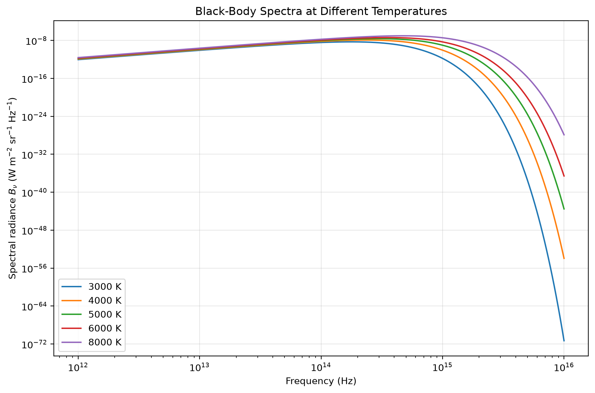
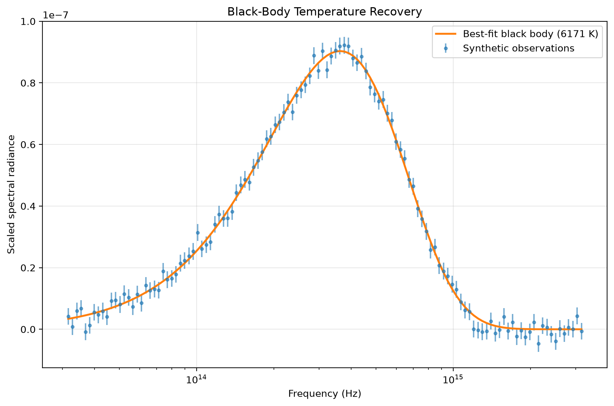

# Black-Body Radiation Modelling and Temperature Estimation

A computational astrophysics project exploring black-body radiation, numerical methods and parameter estimation using Python.

The project models Planck spectra across stellar temperatures, numerically verifies key black-body relationships, and recovers the temperature of a synthetic source from noisy spectral observations.

## Project overview

Black-body radiation provides a fundamental model for understanding the thermal emission of stars and other astrophysical objects.

This project investigates the relationship between temperature and emitted radiation through:

- numerical implementation of Planck's law
- modelling spectra across multiple stellar temperatures
- numerical optimisation of spectral peak frequency
- verification of the frequency-space Wien relation
- numerical integration of black-body spectra
- comparison with the Stefan-Boltzmann law
- nonlinear fitting of noisy synthetic observations
- uncertainty estimation and residual analysis
- automated testing of the core numerical routines

The project was developed and expanded from previous university scientific-programming work into a structured, reproducible computational analysis.

---

## Black-body spectra

Increasing temperature produces both a greater spectral radiance and a shift of the spectral maximum toward higher frequencies.



The numerical peak-finding routine is used across several temperatures to verify the expected relationship

\[
\nu_{\mathrm{peak}} \propto T.
\]

The resulting gradient is compared with the theoretical frequency-space expression

\[
\nu_{\mathrm{peak}}
=
\frac{2.821439\,k_B}{h}T.
\]

---

## Numerical integration and the Stefan-Boltzmann law

The Planck spectrum is integrated numerically over frequency and compared with the analytical Stefan-Boltzmann prediction

\[
L = 4\pi R^2 \sigma T^4.
\]

A log-log analysis of the numerical luminosities recovers the expected scaling

\[
L \propto T^4.
\]

This provides an independent validation of the numerical spectral model.

---

## Temperature recovery from noisy observations

A synthetic black-body spectrum is generated at a known temperature and perturbed with Gaussian measurement noise.

The temperature and scale factor are then recovered using nonlinear least-squares fitting.



This reproduces a simplified astrophysical inference workflow:

```text
physical model
      ↓
synthetic observations
      ↓
measurement uncertainty
      ↓
nonlinear optimisation
      ↓
parameter estimation
      ↓
residual analysis
